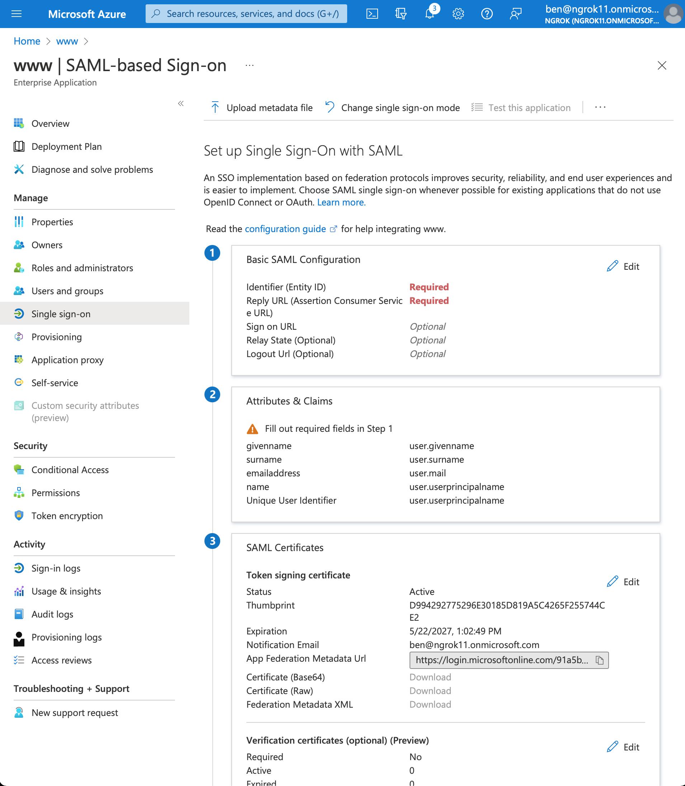
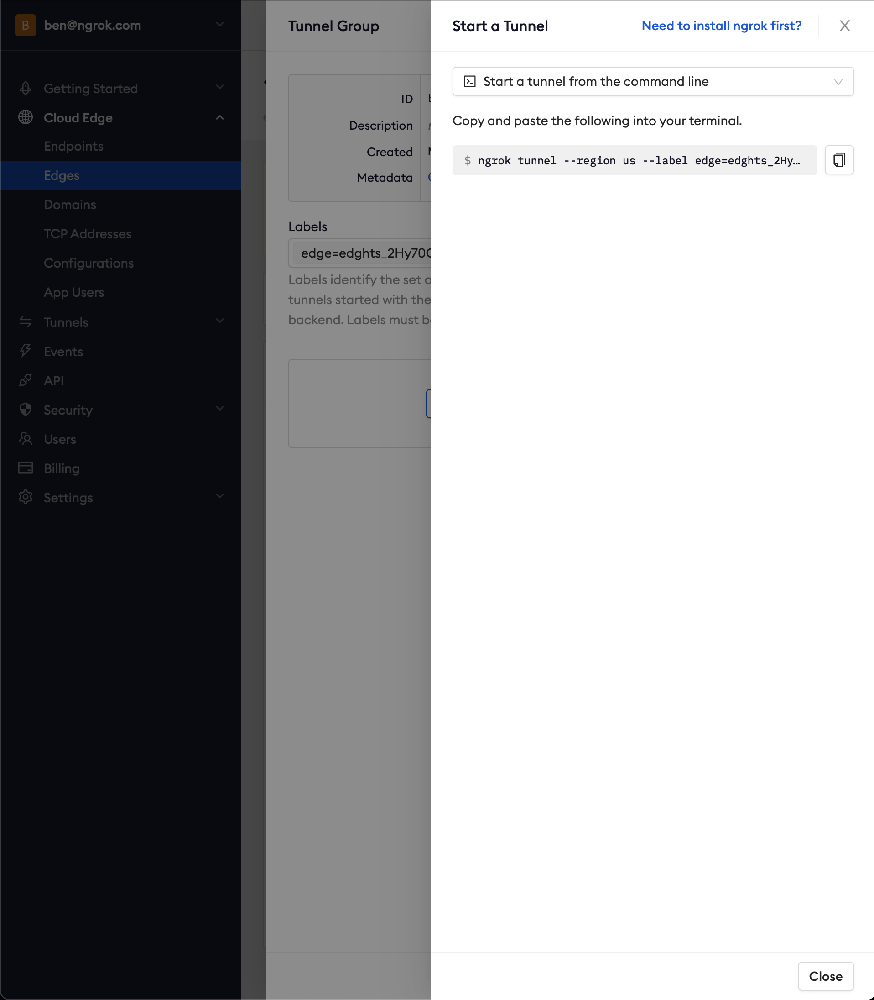
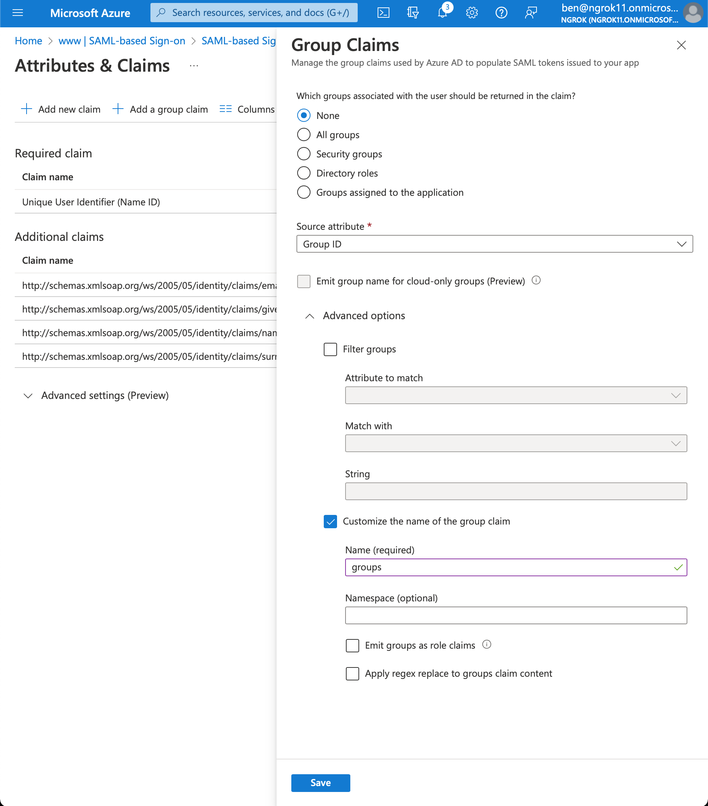

# Azure Active Directory SSO (SAML)
------------

:::tip TL;DR 
To have ngrok enforce Single Sign-On using SAML with Azure Active Directory (Azure AD):
1. [Create an ngrok Edge](#create-edge)
2. [Create an Azure AD application](#create-aad-app)
3. [Update the ngrok configuration with the IdP metadata](#update-ngrok-config)
4. [Test your integration](#test-integration)
5. [Bonus: configure ngrok to enforce authorization](#bonus)
:::

This article details how to configure Azure AD as an Identity Provider for your ngrok Edge.  By integrating Azure AD with ngrok, you can: 

- Restrict access to ngrok tunnels to only users who authenticated via Azure AD
- Configure Azure AD and ngrok to enforce user and group authorization
- Use Azure AD's dashboard to facilitate access to ngrok applications

## Requirements

To configure ngrok tunnels with Azure AD, you must have: 

- an ngrok enterprise account with an access token or admin access to configure edges with SAML
- a Microsoft Azure account with access to an Azure AD tenant

## Step 1: Create an ngrok Edge {#create-edge}

1. Go to the ngrok dashboard https://dashboard.ngrok.com
2. Click __Cloud Edge__ > Edges
3. Create an Edge
- Click __New Edge__
- Click __HTTPS Edge__
- Click the __Pencil Icon__ next to "no description". Enter _Edge With Azure Active Directory SSO_ as the Edge name and click __Save__

4. Configure the SAML module for this Edge
- On the Routes section, click __SAML__
- Click __Begin setup__
- In the Identity Provider section, copy the following XML as a placeholder into the input box

``` 
<?xml version="1.0" encoding="utf-8"?><EntityDescriptor xmlns="urn:oasis:names:tc:SAML:2.0:metadata"></EntityDescriptor>
```

- In the Service Provider section, copy the Entity ID and the ACS URL values generated by ngrok


5. Click __Save__

## Step 2: Create an Azure AD application {#create-aad-app}

1. Go to your Azure AD tenant in Azure https://portal.azure.com/#view/Microsoft_AAD_IAM/ActiveDirectoryMenuBlade/~/Overview

2. Create an enterprise application 
- Starting from the sidebar, in the Manage section, click __Enterprise Applications__ > __New application__
- Give your application a name (eg `www` for a website client).  Click __Create__


3. Assign users/groups for this application 
- In the Getting Started section, click on the box titled __1. Assign users and groups__ > __Add user/group__ 

4. Set up single sign on with SAML
- In the Getting Started section, click on the box titled __2. Set up single sign on__ >  __SAML__
- Configure SAML.  In the Basic SAML Configuration box click __Edit__



- Add Identifier (Entity ID) and Reply URL (Assertion Consumer Service URL) values using the previously the ngrok generated Entity ID and ACS URL 


- Click __Save__
- Download the Metadata XML.  In the SAML Certificates box > Token signing certificate section > click __Download__ for the Federation Metadata XML


## Step 3: Update the ngrok configuration with the IdP metadata {#update-ngrok-config}

1. Back in the ngrok dashboard for your Edge's SAML configuration, upload the XML file generated by Azure AD 


2. Click __Save__

## Step 4: Test the integration {#test-integration}

:::tip Note 
For this step, we assume you have an app running locally (i.e. on localhost:3000) with the ngrok client installed.
:::

1. Launch a tunnel connected to your configured Edge. 
- On your Edge's page, in the Routes section, click __Start a tunnel__


- Copy this command



- Launch a terminal 
- Paste the command. Replace `http://localhost:80` with your local web app address (e.g., `http://localhost:3000`)
- Hit __Enter__ to launch the tunnel

2. Confirm that the tunnel is connected to your edge
- Return to the ngrok dashboard
- Close the __Start a tunnel__ and the __Tunnel group__ drawers
- Refresh the Edge page
- In the Routes section > Traffic section you will see the message _You have 1 tunnel online. Start additional tunnels to begin load balancing._


3. Copy your Edge URL
- On your Edge page, in the Endpoints section, copy the URL

4. Access your Edge application
- In your browser, launch an incognito window
- Access your ngrok tunnel via your copied URL
- You should be prompted to log in with your Microsoft credentials
- After login, you should be able to see the application

## Bonus: Configure ngrok to enforce authorization {#bonus}

1. In Azure, configure the SAML response to include group claims.  In the Attributes & Claims box click __Edit__


2. Click __Add a group claim__ > __Advanced options__ > Customize the name of the group claim
3. Set the name of the group claim to `groups`. This specific value is required for ngrok



4. Click __Save__ 
5. Go to your group page and copy the object Id (Azure AD returns group object Ids, not group names, in the group claim)


6. Configure ngrok to enforce group authorization.  In ngrok on your Edge's page, in the Authorization section, update the groups input with your Azure group id (not group name) values


7. Access your Edge application
- In your browser, launch an incognito window
- Access your ngrok tunnel via your copied URL
- You should be prompted to log in with your Microsoft credentials
- Only users assigned to the authorized groups will have access to the application
